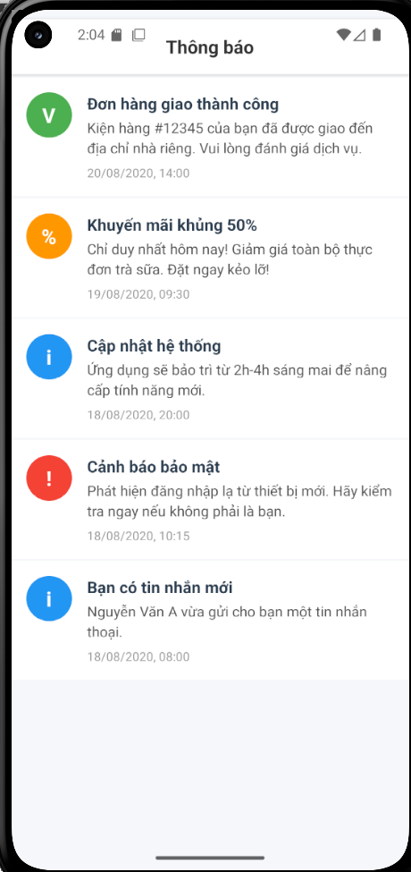

# BÁO CÁO BÀI TẬP BUỔI 3: Flatlist

## 1. Thông tin sinh viên
* **Họ và tên:** Lê Đức Tài
* **Mã sinh viên:** 23810310296
* **Lớp:** D18CNPM4

## 2. Nội dung bài làm
### Bài tập 3.2: TThực hành sử dụng Flatlist

## 3. Kết quả Demo
Ảnh chạy trên máy ảo Android:

